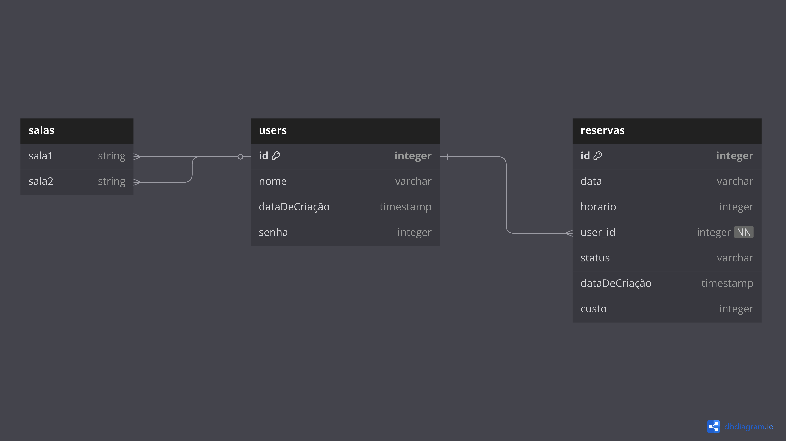

# Documentação do Projeto-Individual-Modulo-2

### Introdução:
Este projeto tem como objetivo desenvolver uma plataforma simples de reservas de salas, na qual um banco de dados registrará os pedidos de reserva feitos pelos clientes.

### Diagrama de banco de dados
É de extrema importância organizar as categorias e tabelas de um banco de dados antes de começar o desenvolvimento de uma plataforma. Com isso em mente desenvolvi esse simples diagram de banco de dados, o qual demontra as principais relações no meu banco de dados.



Para esse projeto, optei por usar 3 tabelas principais: Usuários que utilizaram da plataforma, os quais contam com nomes, ids e senhas; Salas, que o usuario poderia reservar

código SQL:
```
Table users {
  idUser integer [primary key]
  nome varchar
  senha varchar
  email varchar
 
}

Table salas {
 idSalas integer [primary key]
 sala1 string
}

Table reservas {
  reserva_id integer [not null]
  idReserva integer [primary key]
  user_id integer [not null]
  status varchar
  data timestamp
  horário timestamp
  preço string
}

Ref user_reservas: reservas.user_id > users.idUser // many-to-one

Ref: users.idUser > salas.sala1

Ref: salas.sala1 > reservas.reserva_id


```