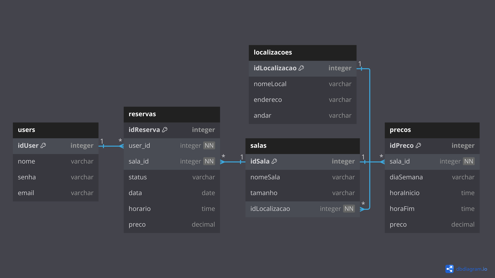

# Documentação do Projeto-Individual-Modulo-2

### Introdução:
Este projeto tem como objetivo desenvolver uma plataforma simples de reservas de salas, na qual um banco de dados registrará os pedidos de reserva feitos pelos clientes.

### Diagrama de banco de dados
É de extrema importância organizar as categorias e tabelas de um banco de dados antes de começar o desenvolvimento de uma plataforma. Com isso em mente desenvolvi esse simples diagram de banco de dados, o qual demontra as principais relações no meu banco de dados.

