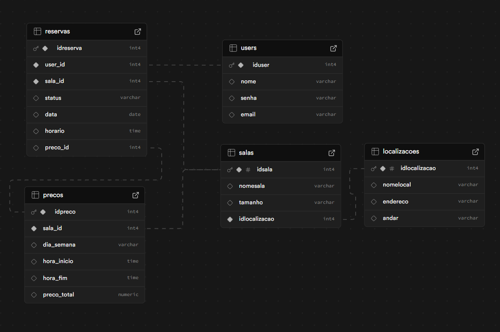

# Documentação do Projeto-Individual-Modulo-2

### Introdução:
Este projeto tem como objetivo desenvolver uma plataforma simples de reservas de salas. Nela, um banco de dados será responsável por registrar e organizar os pedidos feitos pelos usuários, garantindo que as informações sejam armazenadas de forma estruturada e acessível.

### Modelo Relacional
É de extrema importância organizar as categorias e tabelas de um banco de dados antes de começar o desenvolvimento de uma plataforma. Com isso em mente desenvolvi esse simples modelo relacional, o qual demonstra as principais relações no meu banco de dados.



Para este projeto, optei por usar cinco tabelas principais: Usuários, que representam as pessoas que acessam a plataforma, com nome, ID, senha e email; Salas, que podem ser reservadas e trazem informações como nome, tamanho e localização; Localizações, que guardam os dados de onde cada sala está, como nome do lugar, endereço e andar; Preços, que definem o valor de cada sala dependendo do dia da semana e do horário; e, por fim, Reservas, onde ficam todas as informações das reservas feitas, como status, data, horário, valor final e o vínculo com o usuário e a sala. O valor da reserva é calculado automaticamente com base nas regras de preço, levando em conta o horário e o dia em que ela foi feita, o que deixa tudo mais flexível e preciso.

### Modelo Físico (Código SQL):
```
CREATE TABLE users (
  idUser INTEGER PRIMARY KEY,
  nome VARCHAR(255),
  senha VARCHAR(255),
  email VARCHAR(255)
);

CREATE TABLE localizacoes (
  idLocalizacao INTEGER PRIMARY KEY,
  nomeLocal VARCHAR(255),
  endereco VARCHAR(255),
  andar VARCHAR(255)
);

CREATE TABLE salas (
  idSala INTEGER PRIMARY KEY,
  nomeSala VARCHAR(255),
  tamanho VARCHAR(255),
  idLocalizacao INTEGER NOT NULL,
  FOREIGN KEY (idLocalizacao) REFERENCES localizacoes(idLocalizacao)
);

CREATE TABLE precos (
  idPreco INTEGER PRIMARY KEY,
  sala_id INTEGER NOT NULL,
  diaSemana VARCHAR(255),
  horaInicio TIME,
  horaFim TIME,
  preco DECIMAL(10,2),
  FOREIGN KEY (sala_id) REFERENCES salas(idSala)
);

CREATE TABLE reservas (
  idReserva INTEGER PRIMARY KEY,
  user_id INTEGER NOT NULL,
  sala_id INTEGER NOT NULL,
  status VARCHAR(255),
  data DATE,
  horario TIME,
  preco DECIMAL(10,2),
  FOREIGN KEY (user_id) REFERENCES users(idUser),
  FOREIGN KEY (sala_id) REFERENCES salas(idSala)
);
```
Além do modelo relacional, também criei o modelo físico, com o código SQL já estruturado e pronto pra ser usado. Ele é importante porque transforma o que foi pensado no papel em algo que realmente funciona no banco de dados, permitindo que tudo seja executado na prática.

### Modelo MVC

A arquitetura MVC (Model-View-Controller) é um pilar central da organização lógica e estrutural do sistema desenvolvido. O padrão MVC separa a aplicação em três camadas principais: Model, responsável pela lógica de dados; View, pela interface com o usuário; e Controller, pela intermediação entre os dados e a visualização. Essa separação facilita a manutenção, escalabilidade e entendimento do projeto.
Com base nesse paradigma, foi desenvolvido o diagrama abaixo, que ilustra de forma clara e objetiva a interação entre as funcionalidades acessadas pelo usuário final e as estruturas de dados persistidas no banco de dados.
O diagrama está organizado da seguinte forma:

#### Cliente: 
Representa o navegador do usuário, que interage diretamente com a interface da aplicação (Views).

#### Views:
 São as interfaces visuais que exibem informações e recebem entradas dos usuários. Cada uma está conectada a um ou mais Controllers, que processam as requisições e respostas. As views implementadas incluem o catálogo de salas, login e reserva de salas.

#### Controllers: 
Intermediários que recebem as ações da View, processam as regras de negócio e comunicam-se com os Models. Eles são responsáveis por operações como listar, gravar, atualizar e deletar dados das entidades do sistema: usuários, reservas, preços, salas e localizações.

#### Models: 
Representam a estrutura e manipulação dos dados, mapeando as entidades do banco de dados. Eles são acessados pelos Controllers para executar operações que envolvem persistência, consulta ou modificação de dados.

#### 
Servidor de Banco de Dados: Utiliza PostgreSQL, integrado ao Supabase, para armazenamento e gerenciamento dos dados de forma confiável e escalável.

As conexões entre as camadas estão representadas por linhas coloridas, que facilitam a visualização do fluxo de dados em tempo real — desde a entrada do usuário até a persistência final no banco. Esse mapeamento contribui para a clareza da estrutura e o alinhamento da equipe de desenvolvimento com os objetivos técnicos do sistema.


